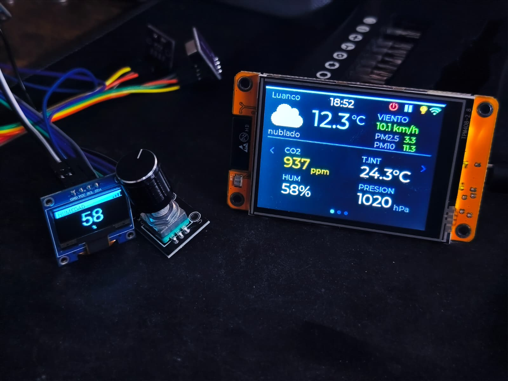

# esphome-homeassistant-lab

<p align="center">
  
</p>

Ejemplos prácticos para integrar **ESP32** con **ESPHome** y **Home Assistant**, mostrando cómo obtener y visualizar datos ambientales (temperatura, humedad, presión, CO₂) y financieros (precio del ETF VWCE en XETRA).
<p align="center">
  
</p>
<p align="center">
  
</p>
> 📝 **Artículo en el blog:** [Monitor de CO₂ DIY con ESP32 y Home Assistant — controla la calidad del aire en casa](https://www.evaristorivieccio.es/2026/04/monitor-de-co%e2%82%82-diy-con-esp32-y-home-assistant-controla-la-calidad-del-aire-en-casa.html)

El proyecto soporta dos plataformas hardware distintas. Elige la que prefieras:

| Plataforma | Descripción | Guía |
|---|---|---|
| **ESP32-C3 Super Mini + OLED** | Placa compacta con pantalla monocromática 128×64. Sensores I²C + encoder rotatorio. | [📖 docs/ESP32_C3.md](docs/ESP32_C3.md) |
| **CYD (Cheap Yellow Display)** | Placa todo-en-uno con TFT 2.8" a color y táctil. No necesita ESP32-C3 ni OLED. | [📖 docs/CYD.md](docs/CYD.md) |

---

## Proyectos disponibles

| YAML | Placa | Qué hace |
|---|---|---|
| `c3_vwce.yaml` | C3 | Ticker VWCE autónomo — consulta Yahoo Finance directo |
| `c3_vwce_dummy.yaml` | C3 | Ticker VWCE — recibe precio desde Home Assistant |
| `c3_sensors_lab.yaml` | C3 | Estación de calidad del aire — todos los datos, 2 páginas rotatorias |
| `c3_sensors_best.yaml` | C3 | Estación óptima — solo el dato más preciso de cada magnitud, 1 página |
| `c3_sensors_best_pages.yaml` | C3 | Estación óptima — 4 páginas a pantalla completa rotatorias |
| `c3_sensors_best_pages_vwce.yaml` | C3 | Estación óptima + VWCE — 5 páginas, Yahoo Finance directo |
| `c3_sensors_best_pages_vwce_dummy.yaml` | C3 | Estación óptima + VWCE — 5 páginas, precio desde HA |
| `c3_sensors_best_pages_vwce_dummy_encoder.yaml` | C3 | Estación óptima + VWCE + encoder KY-040 — rotación automática inteligente, navegación manual, doble click para toggle auto-rotación, doble click + mantener 2s para apagar OLED, cualquier acción para encender, pulsación 10s para factory reset CO₂ |
| `cyd_dummy.yaml` | CYD | TFT 2.8" LVGL táctil — todos los datos desde HA (sin sensores físicos en el CYD) |
| `cyd_sensors_vwce_dummy.yaml` | CYD | TFT 2.8" LVGL táctil — sensores I²C directos + VWCE desde HA |
| `cyd_sensors_vwce.yaml` | CYD | TFT 2.8" LVGL táctil — sensores I²C directos + VWCE Yahoo Finance directo |
| `cyd_weather_dummy.yaml` | CYD | TFT 2.8" LVGL táctil — 3 páginas: panel meteo exterior + sensores interiores (via HA) + previsión +3h/+6h/D+1/D+2 + VWCE |
| `cyd_weather.yaml` | CYD | TFT 2.8" LVGL táctil — 3 páginas: panel meteo exterior + sensores I²C directos + previsión +3h/+6h/D+1/D+2 + VWCE + reset CO₂ táctil |
| `cyd_weather_offset_3dbox.yaml` | CYD | Igual que `cyd_weather.yaml` pero con **compensación térmica dinámica** para CYD montado en caja 3D. Corrige el calentamiento del display ST7789 sobre los sensores I²C mediante offsets que siguen al brillo del backlight con inercia térmica τ≈5min |

---

## Sensores I²C

Ambas plataformas usan los mismos sensores, conectados por el bus **I²C** (4 cables: VCC, GND, SDA, SCL):

| Sensor | Dirección I²C | Datos | Precisión |
|---|---|---|---|
| **SCD40 / SCD41** | `0x62` | CO₂ (ppm), temperatura*, humedad* | CO₂ ±50 ppm |
| **AHT20** | `0x38` | **Temperatura**, **humedad** | ±0.3 °C, ±2 % RH |
| **BMP280** | `0x77` | **Presión** (hPa), temperatura* | ±1 hPa |

> \* El SCD40 y el BMP280 también miden temperatura, pero el AHT20 es más preciso y no sufre self-heating. Por eso los proyectos optimizados usan solo la temperatura y humedad del AHT20.

> El SCD4x usa la presión del BMP280 en tiempo real (`ambient_pressure_compensation_source`) para corregir la lectura de CO₂ según la altitud y condiciones atmosféricas locales.

### Niveles de CO₂ y calidad del aire

El SCD40 mide CO₂ real por absorción infrarroja no dispersiva (NDIR) — no una estimación como los sensores VOC baratos.

| ppm | Estado |
|---|---|
| < 400 | Aire exterior limpio |
| 400–700 | Excelente |
| 700–1000 | Aceptable |
| 1000–1500 | Malo — somnolencia, dificultad de concentración |
| 1500–2000 | Muy malo — dolores de cabeza, cansancio |
| > 2000 | Peligroso |

---

## Home Assistant

Home Assistant centraliza los datos de los sensores, muestra gráficas y permite crear automatizaciones. Puede instalarse en Raspberry Pi, PC, NAS, máquina virtual, etc. Es necesario para los proyectos que reciben datos "via HA" y para el sensor REST de VWCE.

Documentación oficial: [https://www.home-assistant.io/installation/](https://www.home-assistant.io/installation/)

### Instalación rápida (Raspberry Pi + Docker)

```sh
docker pull ghcr.io/home-assistant/raspberrypi4-homeassistant:stable

docker run -d \
  --name homeassistant \
  --restart=unless-stopped \
  -v /root/homeassistant:/config \
  -e TZ=Europe/Madrid \
  --network=host \
  ghcr.io/home-assistant/raspberrypi4-homeassistant:stable
```

> Cambia `/root/homeassistant` por la ruta donde quieras guardar la configuración y `Europe/Madrid` por tu zona horaria si es diferente.

Accede a `http://<IP_DE_TU_RASPBERRY>:8123` desde el navegador para completar la configuración inicial.

### Archivos de configuración de Home Assistant

El repositorio incluye en `homeassistant/` los archivos listos para copiar al directorio de configuración de HA:

| Archivo | Qué hace | Cómo incluirlo en `configuration.yaml` |
|---|---|---|
| `vwce_sensor.yaml` | Sensor REST — consulta el precio de VWCE a Yahoo Finance | `sensor: !include vwce_sensor.yaml` |
| `air_quality_sensor.yaml` | Sensor REST \u2014 PM2.5 y PM10 desde Open-Meteo Air Quality API | `rest: !include air_quality_sensor.yaml` |
| `weather_sensors.yaml` | Templates de condición actual y previsión horaria/diaria (`weather.get_forecasts`) | `template: !include weather_sensors.yaml` |

El `configuration.yaml` incluido en el repositorio ya tiene las tres líneas configuradas como referencia.

> `air_quality_sensor.yaml` requiere añadir `air_quality_url` en el `secrets.yaml` de HA. Ver `homeassistant/secrets.yaml.example` para la plantilla con instrucciones.

> `weather_sensors.yaml` usa la entidad `weather.casa`. Si tu entidad weather tiene otro nombre, actualiza las referencias en el archivo.

---

## Primeros pasos

### 1. Prepara Home Assistant

1. Copia estos archivos de `homeassistant/` a tu carpeta de configuración de HA:
   - `configuration.yaml`
   - `vwce_sensor.yaml`
   - `air_quality_sensor.yaml`
   - `weather_sensors.yaml`
2. Copia `homeassistant/secrets.yaml.example` a `secrets.yaml` y rellena `air_quality_url` con tus coordenadas.
3. Reinicia Home Assistant.
4. Verifica en **Herramientas de desarrollador → Estados** solo las entidades que aplique según tu YAML:
   - Si usas proyectos con VWCE vía HA (`*_dummy` y `cyd_weather*`): `sensor.vwce_precio_yahoo`.
   - Si usas `cyd_weather.yaml` o `cyd_weather_dummy.yaml`: `sensor.<location_name>_temperatura` (por ejemplo `sensor.home_temperatura`).

### 2. Instala ESPHome

Necesitas **Python 3.8+** y **pip**. También puedes usar el add-on oficial de ESPHome en Home Assistant.

```sh
pip install esphome
```

Documentación oficial: [https://esphome.io/guides/installing_esphome.html](https://esphome.io/guides/installing_esphome.html)

> Instala ESPHome en el equipo que vaya a conectar el ESP32 por USB para la primera flash (tu PC, una Raspberry Pi, etc.). Las actualizaciones posteriores van por WiFi (OTA), así que después es irrelevante dónde esté instalado.

### 3. Crea `esphome/secrets.yaml`

Copia `esphome/secrets.yaml.example` a `esphome/secrets.yaml` y rellena tus datos:

```yaml
wifi_ssid: "TuRedWiFi"
wifi_password: "TuContraseña"
ota_password: "una_clave_segura"
api_encryption_key: "clave_base64_de_32_bytes"

# Solo para cyd_weather.yaml y cyd_weather_dummy.yaml
location_name: "home"          # prefijo de entidades HA: sensor.home_temperatura, etc.
location_display: "Mi Casa"    # texto mostrado en la pantalla
```

Para generar la clave de cifrado:

```sh
openssl rand -base64 32
```

> `secrets.yaml` está en `.gitignore` — nunca se sube al repositorio. Los valores `!secret` se leen de este archivo, así puedes publicar los YAML sin exponer contraseñas.

> En `cyd_weather.yaml` y `cyd_weather_dummy.yaml` la zona horaria está definida en `timezone: "Europe/Madrid"`. Si no vives en esa zona, cámbiala en esos YAML.

### 4. Instala los drivers USB (primera vez)

| Chip | Driver |
|------|--------|
| **CP2102** | [Silicon Labs VCP Drivers](https://www.silabs.com/software-and-tools/usb-to-uart-bridge-vcp-drivers?tab=overview) |
| **CH340 / CH341** | [WCH CH341SER](https://www.wch.cn/downloads/CH341SER_ZIP.html) |
| **CH342 / CH343 / CH9102** | [WCH CH343SER](https://www.wch.cn/downloads/CH343SER_ZIP.html) |

> Si no aparece ningún puerto COM (Windows) o `/dev/ttyUSB0` (Linux) al conectar el ESP32, instala los dos primeros — no hay forma rápida de saber qué chip lleva sin abrirla.

### 5. Elige tu plataforma y flashea

- **ESP32-C3 Super Mini** → sigue la guía en [docs/ESP32_C3.md](docs/ESP32_C3.md)
- **CYD (Cheap Yellow Display)** → sigue la guía en [docs/CYD.md](docs/CYD.md)

Para empezar rápido con CYD:

```sh
# Primera carga por USB (mantén BOOT pulsado al conectar)
esphome run esphome/cyd_weather_dummy.yaml --device COMx

# Siguientes cargas por WiFi (OTA)
esphome run esphome/cyd_weather_dummy.yaml --device cyd-weather-dummy.local
```

> **Primera flash:** siempre por USB (botón BOOT pulsado al conectar). Las siguientes actualizaciones van por WiFi (OTA) automáticamente.

### 6. Comprueba que todo está bien

1. La pantalla muestra hora, icono wifi y datos.
2. En HA el dispositivo aparece como integrado por ESPHome.
3. Si algún dato sale `--`, revisa que la entidad exista en HA con el mismo nombre.

---

## Referencia técnica

### `framework: esp-idf`

ESP-IDF es el framework oficial de Espressif. Más estable que Arduino, mejor gestión de WiFi y memoria. Todos los proyectos lo usan.

### `ota` — actualización por WiFi

Permite flashear sin cable USB a partir de la segunda vez. La contraseña protege contra actualizaciones no autorizadas.

### `api` — integración con Home Assistant

Protocolo nativo de ESPHome. HA descubre el dispositivo automáticamente. `encryption.key` cifra la comunicación con AES-128.

### `wifi: power_save_mode: none`

El ESP32 siempre conectado — evita latencia y que HA lo marque como *unavailable*.

### `logger: level: DEBUG`

Envía mensajes de diagnóstico por el puerto serie y desde la UI web de ESPHome. En un dispositivo estable se puede bajar a `INFO` o `WARNING` para reducir ruido.

---

## Errores típicos y solución

### `Entity not found: sensor.home_*` en CYD Weather

Causa habitual: `location_name` no coincide con el prefijo real de tus sensores en Home Assistant.

Solución:
1. Mira en HA el nombre real de una entidad (por ejemplo `sensor.mi_casa_temperatura`).
2. Pon ese prefijo en `esphome/secrets.yaml`: `location_name: "mi_casa"`.
3. Recompila y sube por OTA.

### `Entity not found: weather.casa`

Causa: tu entidad weather no se llama `weather.casa`.

Solución:
1. Abre `homeassistant/weather_sensors.yaml`.
2. Sustituye `weather.casa` por tu entidad real (por ejemplo `weather.home`).
3. Reinicia Home Assistant.

### `Invalid encryption key` en ESPHome API

Causa: `api_encryption_key` no tiene formato base64 de 32 bytes.

Solución:
```sh
openssl rand -base64 32
```
Pega el resultado en `esphome/secrets.yaml`.

### No aparece puerto COM / `/dev/ttyUSB*`

Causa: falta driver USB-UART.

Solución:
1. Instala driver CP2102 y/o CH340/CH341 (tabla de drivers arriba).
2. Desconecta y reconecta la placa.
3. Reintenta `esphome run ... --device COMx`.

### No entra en modo flash por USB (primera vez)

Causa: la placa no está en modo bootloader.

Solución:
1. Mantén pulsado **BOOT** al conectar USB.
2. Suelta **BOOT** cuando el puerto aparezca.
3. Ejecuta de nuevo el comando `esphome run`.

### La hora en pantalla está mal

Causa típica: zona horaria no ajustada.

Solución:
1. Corrige `timezone:` en `cyd_weather.yaml` o `cyd_weather_dummy.yaml`.
2. Recompila y sube OTA.
3. Verifica también la zona horaria de Home Assistant.

### `Data not ready` repetido en SCD4x

Causa típica: problema físico de conexión (falso contacto en cables/conector I2C, pin flojo, soldadura tocada al manipular la placa/caja). En algunos casos, tras varias reconexiones forzadas, el propio sensor puede quedar dañado.

Solución recomendada (orden práctico):
1. Revisar y rehacer cableado I2C (`SDA`, `SCL`, `3V3`, `GND`) y conectores.
2. Comprobar alimentación estable y evitar tensión mecánica al cerrar caja.
3. Probar el mismo montaje con otro SCD4x conocido bueno.
4. Si al cambiar el sensor desaparece el problema, dar por confirmado sensor dañado.

Caso real de este repo: durante pruebas de encaje en caja hubo manipulación mecánica, aparecieron `Data not ready` repetidos y se resolvió sustituyendo el sensor.

### SCD4x: compatibilidad de modos de medición

Importante de compatibilidad: `measurement_mode: single_shot` es solo para SCD41 (y SCD43 según datasheet actual de Sensirion). En SCD40 puede aparentar funcionar, pero está fuera de especificación y no debe considerarse una solución válida.

Qué hace cada modo:
- `periodic` (por defecto): mide cada 5 s. Mejor respuesta temporal, a costa de más consumo y más self-heating.
- `low_power_periodic`: mide cada 30 s. Menor consumo y menor calentamiento; requiere `update_interval >= 30s`.
- `single_shot` (solo SCD41/SCD43): dispara una medición completa en cada `update_interval` (tarda ~5 s). Útil para intervalos largos y batería.
- `single_shot_rht_only` (solo SCD41/SCD43): mide solo temperatura y humedad (~50 ms); CO₂ se reporta como `0`.

```yaml
- platform: scd4x
  address: 0x62
  # SCD40: periodic (por defecto)
  # Opcional: low_power_periodic (con update_interval >= 30s)
  update_interval: 30s
  ambient_pressure_compensation_source: bmp280_press
```

Estado actual del repositorio: los YAML con SCD40 no fuerzan `measurement_mode: single_shot`.

> La autocalibración ASC sigue activa en los modos soportados del SCD40 (`periodic` y `low_power_periodic`).

---

## Estructura del repositorio

```
.
├── README.md
├── docs/
│   ├── CYD.md
│   └── ESP32_C3.md
├── esphome/
│   ├── .esphome/
│   ├── .gitignore
│   ├── c3_sensors_best.yaml
│   ├── c3_sensors_best_pages.yaml
│   ├── c3_sensors_best_pages_vwce.yaml
│   ├── c3_sensors_best_pages_vwce_dummy.yaml
│   ├── c3_sensors_best_pages_vwce_dummy_encoder.yaml
│   ├── c3_sensors_lab.yaml
│   ├── c3_vwce.yaml
│   ├── c3_vwce_dummy.yaml
│   ├── cyd_dummy.yaml
│   ├── cyd_sensors_vwce.yaml
│   ├── cyd_sensors_vwce_dummy.yaml
│   ├── cyd_weather.yaml
│   ├── cyd_weather_dummy.yaml
│   ├── cyd_weather_offset_3dbox.yaml
│   ├── secrets.yaml
│   └── secrets.yaml.example
├── homeassistant/
│   ├── air_quality_sensor.yaml
│   ├── configuration.yaml
│   ├── secrets.yaml.example
│   ├── vwce_sensor.yaml
│   └── weather_sensors.yaml
├── images/
│   ├── 1.png
│   ├── cyd.jpeg
│   ├── cyd2.jpeg
│   ├── cyd3.jpeg
│   ├── cyd4.jpeg
│   ├── cyd5.jpeg
│   ├── cydpino.png
│   ├── eltiempo1.jpeg
│   ├── eltiempo2.jpeg
│   ├── eltiempo3.jpeg
│   ├── eltiempo4.jpeg
│   ├── eltiempo5.jpeg
│   ├── esquema.webp
│   ├── HA.jpeg
│   ├── portada.png
│   ├── sensores.jpeg
│   └── todos_los_sensores.png
```

---

## Mejoras futuras

- Montaje permanente: hub I²C + carcasa 3D impresa — cuando se cierra el CYD en una caja el display calienta los sensores, ver [Proyecto 13 en docs/CYD.md](docs/CYD.md) para la solución con compensación térmica dinámica
- Diseñar PCB a medida para sustituir la protoboard

---

**¡Contribuciones y mejoras son bienvenidas!**
