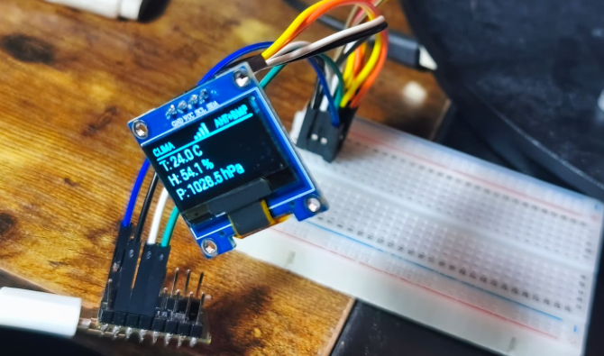
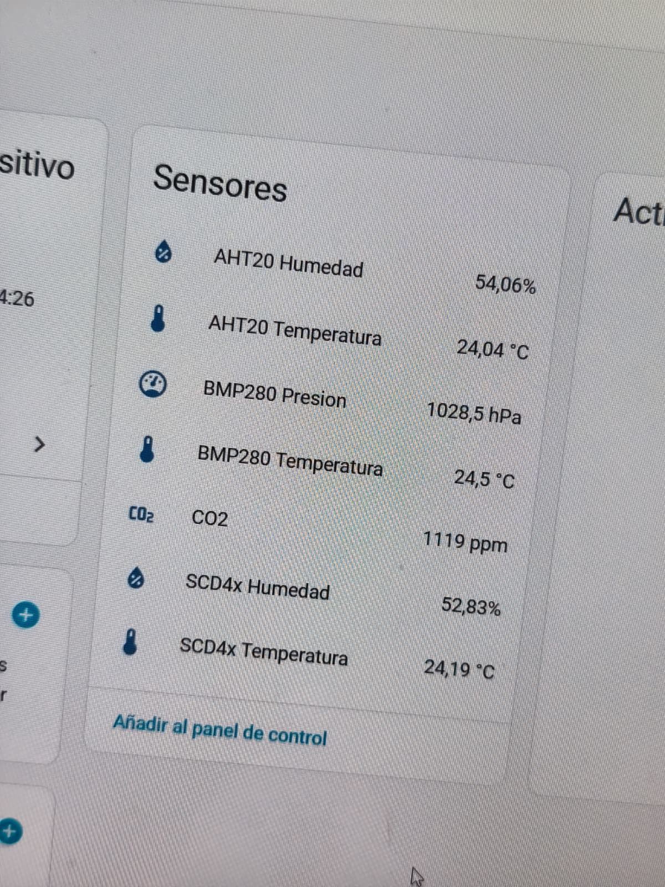
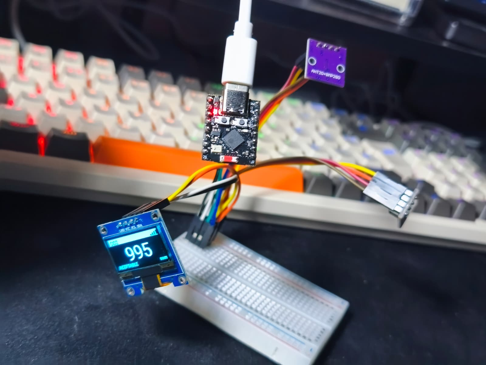

# esphome-homeassistant-lab

<p align="center">
  
</p>

Ejemplos prácticos para integrar un **ESP32-C3** con **ESPHome** y **Home Assistant**, mostrando cómo obtener y visualizar datos ambientales (temperatura, humedad, presión, CO₂) y financieros (precio del ETF VWCE en XETRA) en una pantalla OLED.

El repositorio contiene cuatro proyectos independientes, cada uno listo para flashear:

| YAML | Qué hace |
|---|---|
| `vwce.yaml` | Consulta Yahoo Finance directamente y muestra el precio de VWCE en la OLED |
| `vwce_dummy.yaml` | Recibe el precio de VWCE desde Home Assistant y lo muestra en la OLED |
| `sensors_lab.yaml` | Estación de calidad del aire — CO₂, T, H y P en dos páginas rotatorias |
| `sensors_best.yaml` | Igual que el anterior pero expone a HA solo el dato más preciso de cada magnitud — pantalla en una página |
| `sensors_best_pages.yaml` | Versión final: mismos 4 datos óptimos, pero 4 páginas a pantalla completa rotatorias |

---

## Lista de piezas

- [Placa de desarrollo ESP32-C3 Super Mini, 16 pines tipo C](https://es.aliexpress.com/item/1005009014269977.html)
- [Pantalla OLED 0,96" I2C 128x64 SSD1306](https://es.aliexpress.com/item/1005006365881525.html)
- [Sensor SCD40/SCD41 CO₂, temperatura y humedad I2C](https://es.aliexpress.com/item/1005009897956849.html)
- [AHT20 + BMP280 — temperatura, humedad y presión del aire](https://es.aliexpress.com/item/1005005321276932.html)
- [Módulo hub I2C (expansión de bus)](https://es.aliexpress.com/item/1005002811407142.html)
- [Placa de pruebas sin soldadura, 400 puntos](https://es.aliexpress.com/item/1005010426826947.html)
- [TP4056 — módulo cargador de batería LiPo con protección](https://es.aliexpress.com/item/1005009887303870.html)

> **Nota sobre la protoboard y el hub I2C:** La protoboard es ideal para montar y probar el circuito rápidamente. El hub I2C permite centralizar todas las conexiones en un módulo pequeño y ordenado — útil para un montaje permanente dentro de una carcasa. Ver [Mejoras futuras](#mejoras-futuras).

> **Nota sobre la batería:** El TP4056 se incluyó para explorar alimentación con LiPo. Finalmente se descartó: una LiPo que se descarga baja la tensión progresivamente y el ESP32 acaba reiniciándose. La solución correcta requeriría un *boost converter* a 3.3V estable. El proyecto usa alimentación USB directa.

---

## Esquema de conexión

Todos los módulos se comunican por el bus **I2C** — solo 4 cables: VCC, GND, SDA y SCL.

<p align="center">
  
</p>

| Pin módulo | Pin ESP32-C3 Super Mini |
|-----------|------------------------|
| **VCC** | **3V3** |
| **GND** | **GND** |
| **SDA** | **GPIO4** |
| **SCL** | **GPIO5** |

> Si usas el hub I2C, conecta un único par SDA/SCL desde el ESP32 al hub y desde ahí reparte al resto de módulos.

---

## Home Assistant

Home Assistant es la plataforma de domótica que centraliza los datos de los sensores, muestra gráficas y permite crear automatizaciones. Puede instalarse en Raspberry Pi, PC, NAS, máquina virtual, etc.

Documentación oficial de instalación: [https://www.home-assistant.io/installation/](https://www.home-assistant.io/installation/)

### Ejemplo: instalación en Raspberry Pi con Docker

```sh
docker pull ghcr.io/home-assistant/raspberrypi4-homeassistant:stable

docker run -d \
  --name homeassistant \
  --restart=unless-stopped \
  -v /root/homeassistant:/config \
  -e TZ=Europe/Madrid \
  --network=host \
  ghcr.io/home-assistant/raspberrypi4-homeassistant:stable
```

> Cambia `/root/homeassistant` por la ruta donde quieras guardar la configuración y `Europe/Madrid` por tu zona horaria si es diferente.

Una vez arrancado, accede a `http://<IP_DE_TU_RASPBERRY>:8123` desde el navegador para completar la configuración inicial.

---

## Primeros pasos

### 1. Instala ESPHome

```sh
pip install esphome
```

Documentación oficial: [https://esphome.io/guides/installing_esphome.html](https://esphome.io/guides/installing_esphome.html)

También necesitas **Python 3.8+** y **pip** instalados. Si usas Home Assistant, también puedes instalar el add-on oficial de ESPHome desde su tienda — no necesitas línea de comandos.

### 2. Configura tus credenciales

Copia `esphome/secrets.yaml.example` a `esphome/secrets.yaml` y rellena tus datos:

```yaml
wifi_ssid: "TuRedWiFi"
wifi_password: "TuContraseña"
ota_password: "una_clave_segura"
api_encryption_key: "clave_base64_de_32_bytes"
```

Para generar la clave de cifrado:

```sh
openssl rand -base64 32
```

> `secrets.yaml` está en `.gitignore` — nunca se sube al repositorio. Así puedes compartir los YAML sin exponer contraseñas.

### 3. Instala los drivers USB (primera vez)

Para que el ordenador reconozca el ESP32 al conectarlo por USB necesitas el driver de su chip USB-serie. El ESP32-C3 Super Mini puede traer chips distintos según el fabricante:

| Chip | Driver |
|------|--------|
| **CP2102** | [Silicon Labs VCP Drivers](https://www.silabs.com/software-and-tools/usb-to-uart-bridge-vcp-drivers?tab=overview) |
| **CH340 / CH341** | [WCH CH341SER](https://www.wch.cn/downloads/CH341SER_ZIP.html) |
| **CH342 / CH343 / CH9102** | [WCH CH343SER](https://www.wch.cn/downloads/CH343SER_ZIP.html) |

> Si no aparece ningún puerto COM (Windows) al conectar el ESP32, instala los dos primeros — no hay forma rápida de saber qué chip lleva sin abrirla.

### 4. Elige un proyecto y flashea

Con los requisitos anteriores listos, elige el proyecto que quieres usar y sigue los pasos de su sección. Cada sección incluye los comandos exactos.

> **Mecanismo:** la primera vez siempre es por USB (botón BOOT pulsado al conectar). A partir de la segunda vez, ESPHome actualiza el firmware por WiFi (OTA) sin tocar cables.

---

## Proyecto 1: ticker VWCE autónomo (`vwce.yaml`)

El ESP32 consulta **directamente** Yahoo Finance cada 60 segundos mediante HTTP y muestra el precio del ETF VWCE en la pantalla OLED. **No necesita Home Assistant** — funciona de forma completamente autónoma.

### Cómo funciona

1. Cada 60 s el ESP32 lanza una petición GET a `query1.finance.yahoo.com`.
2. Parsea el campo `regularMarketPrice` del JSON de respuesta.
3. Publica el precio en el sensor `vwce_price` con `publish_state()`.
4. La pantalla OLED lo muestra en tiempo real.
5. Si tienes Home Assistant, también expone `sensor.vwce_ticker_vwce_precio` con histórico y gráficas automáticas.

### Por qué `useragent: "Mozilla/5.0"`

Yahoo Finance bloquea peticiones que no parecen venir de un navegador. Sin este campo, responde con error o datos vacíos. Es un workaround habitual para APIs públicas sin acceso oficial.

### Flashear

> **Primera vez:** mantén pulsado el botón **BOOT** del ESP32 mientras lo conectas por USB, suéltalo, y ejecuta el comando con `--device COMx` (reemplaza `COMx` por el puerto de tu equipo: `COM3` en Windows, `/dev/ttyUSB0` en Linux).

```sh
# Primera vez por USB
esphome run esphome/vwce.yaml --device COMx

# Siguientes veces por OTA (sin cable)
esphome run esphome/vwce.yaml --device vwce-ticker.local
```

<p align="center">
  
</p>

---

## Proyecto 2: ticker VWCE via Home Assistant (`vwce_dummy.yaml`)

Variante para cuando ya tienes **Home Assistant** funcionando con el sensor REST de VWCE configurado. En lugar de que el ESP32 consulte Yahoo Finance, **recibe el precio desde HA** a través de la API nativa de ESPHome.

### Diferencia respecto a `vwce.yaml`

| | `vwce.yaml` | `vwce_dummy.yaml` |
|---|---|---|
| Quién consulta Yahoo Finance | El ESP32 | Home Assistant |
| Requiere HA activo | No | Sí |
| `http_request` en el YAML | Sí | No |
| `vwce_price` se expone a HA | Sí (entidad propia) | No — `internal: true` (HA ya lo tiene) |

### Configurar Home Assistant

Añade en `homeassistant/configuration.yaml`:

```yaml
sensor: !include homeassistant/vwce_sensor.yaml
```

El archivo `vwce_sensor.yaml` contiene el sensor REST listo para usar.

### Flashear

```sh
# Primera vez por USB
esphome run esphome/vwce_dummy.yaml --device COMx

# Siguientes veces por OTA
esphome run esphome/vwce_dummy.yaml --device vwce-dummy.local
```

---

## Proyecto 3: estación de calidad del aire — laboratorio (`sensors_lab.yaml`)

Conecta tres sensores físicos al ESP32 y muestra todos sus datos en la pantalla OLED con **dos páginas que rotan automáticamente cada 6 segundos**. Todos los valores se exponen a Home Assistant como entidades independientes con histórico.

<p align="center">
  
</p>

### Sensores conectados

| Sensor | Plataforma ESPHome | Dirección I2C | Datos |
|---|---|---|---|
| **SCD40 / SCD41** | `scd4x` | `0x62` (fija) | CO₂ (ppm), temperatura, humedad |
| **AHT20** | `aht10` con `variant: AHT20` | `0x38` | Temperatura, humedad |
| **BMP280** | `bmp280_i2c` | `0x77`* | Temperatura, presión (hPa) |
| **SSD1306** | `ssd1306_i2c` | `0x3C` | Pantalla 128×64 |

> \* El módulo combo AHT20+BMP280 habitual en AliExpress lleva SDO a VCC → dirección `0x77`. Si tienes un BMP280 suelto (SDO a GND), la dirección será `0x76`. El log de arranque con `scan: true` te lo confirma.

### Entidades en Home Assistant

Las entidades se crean automáticamente al añadir el dispositivo en HA — no hace falta configurar nada adicional.

| Entidad | Unidad | Fuente |
|---|---|---|
| `sensor.sensors_lab_co2` | ppm | SCD40 |
| `sensor.sensors_lab_scd4x_temperatura` | °C | SCD40 |
| `sensor.sensors_lab_scd4x_humedad` | % | SCD40 |
| `sensor.sensors_lab_aht20_temperatura` | °C | AHT20 |
| `sensor.sensors_lab_aht20_humedad` | % | AHT20 |
| `sensor.sensors_lab_bmp280_temperatura` | °C | BMP280 |
| `sensor.sensors_lab_bmp280_presion` | hPa | BMP280 |

<p align="center">
  
</p>

<p align="center"><em>Vista de las entidades en Home Assistant, con histórico y gráficas automáticas.</em></p>

### ¿Por qué hay datos duplicados? Comparativa de sensores

El SCD40, el AHT20 y el BMP280 miden algunas magnitudes en común. En `sensors_lab.yaml` se exponen todas para poder verlas y comparar. `sensors_best_pages.yaml` (Proyecto 4) aplica la conclusión y expone solo el dato óptimo.

**Temperatura:**

| Sensor | Precisión | Problema |
|---|---|---|
| **AHT20** | **±0.3 °C** | Ninguno — **mejor opción** |
| BMP280 | ±0.5 °C | Aceptable |
| SCD40 | ±0.8 °C | *Self-heating*: la cámara de CO₂ genera calor y lee **1.5–2 °C por encima** aunque aplique un offset interno (`Temperature offset: 4.00°C` en el log) |

**Humedad:**

| Sensor | Precisión | Problema |
|---|---|---|
| **AHT20** | **±2 % RH** | Ninguno — **mejor opción** |
| SCD40 | ±6 % RH | Error triple; además afectado por el self-heating |

**CO₂ y presión:** sin competencia — el SCD40 es el único con sensor NDIR de CO₂ y el BMP280 el único con barómetro.

### Pantalla OLED: dos páginas rotatorias

La pantalla alterna cada **6 segundos** entre dos páginas. Los sensores se leen cada **30 s**; la pantalla se redibuja cada segundo con el último valor disponible.

**Página 1 — CO₂:**
- Cabecera: `CO2` / `SCD40` + barras de señal WiFi
- Valor de CO₂ en número grande centrado (font 24 px)
- Temperatura y humedad del SCD40 en el pie *(se muestran para comparación, aunque AHT20 sea más preciso para esas magnitudes)*

**Página 2 — Clima:**
- Cabecera: `CLIMA` / `AHT+BMP` + barras WiFi
- Temperatura AHT20 · Humedad AHT20 · Presión BMP280

### Niveles de CO₂ y calidad del aire

El SCD40 mide CO₂ real por absorción infrarroja no dispersiva (NDIR) — no una estimación como los sensores VOC baratos.

| ppm | Estado |
|---|---|
| < 400 | Aire exterior limpio |
| 400–700 | Excelente |
| 700–1000 | Aceptable |
| 1000–1500 | Malo — somnolencia, dificultad de concentración |
| 1500–2000 | Muy malo — dolores de cabeza, cansancio |
| > 2000 | Peligroso |

> Un espacio interior con personas y ventanas cerradas sube fácilmente a 1000–1400 ppm. Abrir una ventana 10 minutos lo baja rápidamente.

### Auto-calibración del SCD40 (ASC)

El SCD40 asume que el valor mínimo de los últimos 7 días es ~400 ppm (aire fresco) y se recalibra automáticamente. Si el sensor nunca se expone a aire exterior puede descalibrarse hacia abajo. Para desactivarlo:

```yaml
- platform: scd4x
  automatic_self_calibration: false
```

### Frecuencias de actualización

| Componente | Frecuencia |
|---|---|
| Lectura de sensores | cada 30 s |
| Redibujado de pantalla | cada 1 s |
| Rotación de página | cada 6 s |
| SCD40 internamente | cada 5 s (modo periódico) |

### Flashear

```sh
# Primera vez por USB
esphome run esphome/sensors_lab.yaml --device COMx

# Siguientes veces por OTA
esphome run esphome/sensors_lab.yaml --device sensors-lab.local
```

---

## Proyecto 4: estación óptima — 4 páginas a pantalla completa (`sensors_best_pages.yaml`)

Versión final de la estación de calidad del aire. Mismos tres sensores físicos y **mismos 4 datos óptimos** que `sensors_best.yaml`, pero la pantalla muestra **una magnitud por página** con el valor en la tipografía más grande posible (font 40 px). Rota automáticamente cada 6 segundos.

| Magnitud | Sensor elegido | Motivo |
|---|---|---|
| CO₂ | SCD40 | Único sensor NDIR del bus |
| Temperatura | AHT20 | ±0.3°C, sin self-heating |
| Humedad | AHT20 | ±2% RH |
| Presión | BMP280 | Único barómetro del bus |

### Entidades en Home Assistant (solo 4)

| Entidad | Unidad | Sensor |
|---|---|---|
| `sensor.sensors_best_pages_co2` | ppm | SCD40 |
| `sensor.sensors_best_pages_temperatura` | °C | AHT20 |
| `sensor.sensors_best_pages_humedad` | % | AHT20 |
| `sensor.sensors_best_pages_presion` | hPa | BMP280 |

### Pantalla OLED: 4 páginas a pantalla completa

<p align="center">
  
</p>

Cada página muestra **una sola magnitud** con el valor en 40 px, para que sea legible desde lejos. La rotación es cada 6 segundos, igual que en `sensors_lab.yaml`.

Layout de cada página (128×64 px):

| Zona | y px | Contenido |
|---|---|---|
| Cabecera invertida | 0–12 | Etiqueta en blanco sobre fondo negro + barras WiFi |
| Valor | 13–53 | Número en font_huge (40 px), centrado |
| Pie | 55–63 | Unidad (`ppm`, `°C`, `%`, `hPa`) |

Ejemplo — página CO₂:

```
█ CO2                      ▂▄▆█ █

           1295

             ppm
```

En la página de CO₂ el pie también muestra la calidad del aire (izquierda):

| CO₂ (ppm) | Pantalla |
|---|---|
| ≤ 700 | `BUENO` |
| 701–1000 | `ACEPTABLE` |
| 1001–1500 | `MALO` |
| > 1500 | `PELIGROSO` |

> **`sensors_best.yaml`** es la versión anterior: mismos 4 datos óptimos pero todo en una sola página compacta. Disponible en el repositorio si prefieres ese layout.

### Flashear

```sh
# Primera vez por USB
esphome run esphome/sensors_best_pages.yaml --device COMx

# Siguientes veces por OTA
esphome run esphome/sensors_best_pages.yaml --device sensors-best-pages.local
```

---

## Referencia técnica: configuración común

Todos los YAML comparten estos bloques. Esta sección explica qué hace cada uno.

### `secrets.yaml` — credenciales separadas del código

Los valores `!secret` se leen de `esphome/secrets.yaml`, que no se sube al repositorio. Así puedes publicar los YAML sin exponer contraseñas.

### `framework: esp-idf`

ESP-IDF es el framework oficial de Espressif (fabricante del ESP32). Más estable que Arduino, mejor gestión de WiFi y memoria, y mantenido directamente por el fabricante del chip.

### `ota` — actualización por WiFi

Permite flashear el firmware sin conectar el cable USB a partir de la segunda vez. La contraseña evita que cualquier dispositivo en la misma red pueda sobrescribir el firmware.

### `api` — integración con Home Assistant

Activa el protocolo nativo de ESPHome para que HA descubra el dispositivo automáticamente. La `encryption.key` cifra toda la comunicación con AES-128.

### `logger: level: DEBUG`

Envía mensajes de diagnóstico por el puerto serie y desde la UI web de ESPHome. En un dispositivo estable se puede bajar a `INFO` o `WARNING` para reducir ruido.

### `wifi: power_save_mode: none`

El default en esp-idf es `light` (el chip duerme entre paquetes WiFi). Con `none` el ESP32 siempre está conectado — evita latencia y que HA lo marque como *unavailable*. Sin coste real en un dispositivo enchufado.

### Bus I2C — GPIO4/GPIO5, 100kHz

La frecuencia la marca el módulo más lento del bus. El SCD40 tiene un máximo de 100kHz según su datasheet, aunque el SSD1306 y el BMP280 soporten 400kHz.

`scan: true` escanea el bus al arrancar y muestra en el log las direcciones detectadas — muy útil para verificar el cableado:

```
[C][i2c.idf:119]: Found device at address 0x38   ← AHT20
[C][i2c.idf:119]: Found device at address 0x3C   ← SSD1306
[C][i2c.idf:119]: Found device at address 0x62   ← SCD40
[C][i2c.idf:119]: Found device at address 0x77   ← BMP280
```

### LED integrado GPIO8

El ESP32-C3 Super Mini tiene un LED azul en GPIO8 (pin invertido: LOW = encendido). Todos los YAML incluyen el bloque comentado:

```yaml
# light:
#   - platform: status_led
#     name: "LED"
#     pin:
#       number: GPIO8
#       inverted: true
#     restore_mode: ALWAYS_OFF
```

Descomentarlo añade un botón en HA para encender/apagar el LED. Útil para verificar que el pin funciona.

> El ESP32-C3 *Mini* (distinto al *Super Mini*) tiene un LED RGB (WS2812) en GPIO8 — requiere `esp32_rmt_led_strip` en lugar de `status_led`.

### Estructura del repositorio

```
esphome/
  vwce.yaml             # Proyecto 1: ticker VWCE autónomo
  vwce_dummy.yaml       # Proyecto 2: ticker VWCE via Home Assistant
  sensors_lab.yaml      # Proyecto 3: estación laboratorio
  sensors_best.yaml           # estación óptima — pantalla 1 página
  sensors_best_pages.yaml     # Proyecto 4: estación óptima — 4 páginas
  secrets.yaml.example  # Plantilla de credenciales (no subas secrets.yaml)
homeassistant/
  configuration.yaml    # Configuración mínima de Home Assistant
  vwce_sensor.yaml      # Sensor REST de VWCE para usar con vwce_dummy.yaml
images/                 # Imágenes del README
```

---

## Mejoras futuras

### Montaje definitivo: hub I²C + carcasa 3D impresa

Pasar de la protoboard a un montaje permanente y compacto:

1. Centralizar todas las conexiones I²C en el **hub I²C** ya comprado.
2. Sustituir la protoboard por soldadura directa o PCB pequeña.
3. Diseñar e imprimir una **carcasa a medida en 3D** que aloje el ESP32, la OLED y los sensores.

---

### Navegación con encoder rotatorio (KY-040)

Girar el eje cambia de página; pulsar confirma. Elimina la rotación automática por tiempo.

- [Módulo KY-040 — encoder rotatorio 360°, 5V](https://es.aliexpress.com/item/1005008796691020.html)
- Pines sugeridos (libres de I²C GPIO4/5): CLK→GPIO6, DT→GPIO7, SW→GPIO10
- Cambios en YAML: componente `rotary_encoder`, `binary_sensor` para SW, variable `globals` para la página activa.

---

### Puerto a pantalla TFT 2.8" con táctil (ESP32-2432S028R / CYD)

Mismos proyectos sobre una placa todo-en-uno con display ILI9341 a color (240×320 px) y táctil resistivo XPT2046.

- [Pantalla Inteligente ESP32 2.8" — TFT 240×320 táctil](https://es.aliexpress.com/item/1005010399042230.html)
- [Pinout completo ESP32-2432S028R — RandomNerdTutorials](https://randomnerdtutorials.com/esp32-cheap-yellow-display-cyd-pinout-esp32-2432s028r/)

**Cambios clave en el YAML:**

| Qué | Antes | Después |
|---|---|---|
| `esp32.board` | `esp32-c3-devkitm-1` | `esp32dev` |
| `display` | `ssd1306_i2c` 128×64 mono | `ili9341` 240×320 color, bus HSPI (GPIO14/13/15/2) |
| Táctil | — | `xpt2046`, bus VSPI (GPIO25/32/39/33/36) |
| I²C sensores | GPIO4/GPIO5 | **GPIO27 (SDA) + GPIO22 (SCL)** — únicos pines I²C libres |

> GPIO21 está ocupado por el backlight; GPIO35 es input-only. Solo quedan GPIO22 y GPIO27 para periféricos externos.

`wifi`, `ota`, `api`, `logger`, la lógica de sensores y el parseo de Yahoo Finance no cambian.

---

**¡Contribuciones y mejoras son bienvenidas!**
