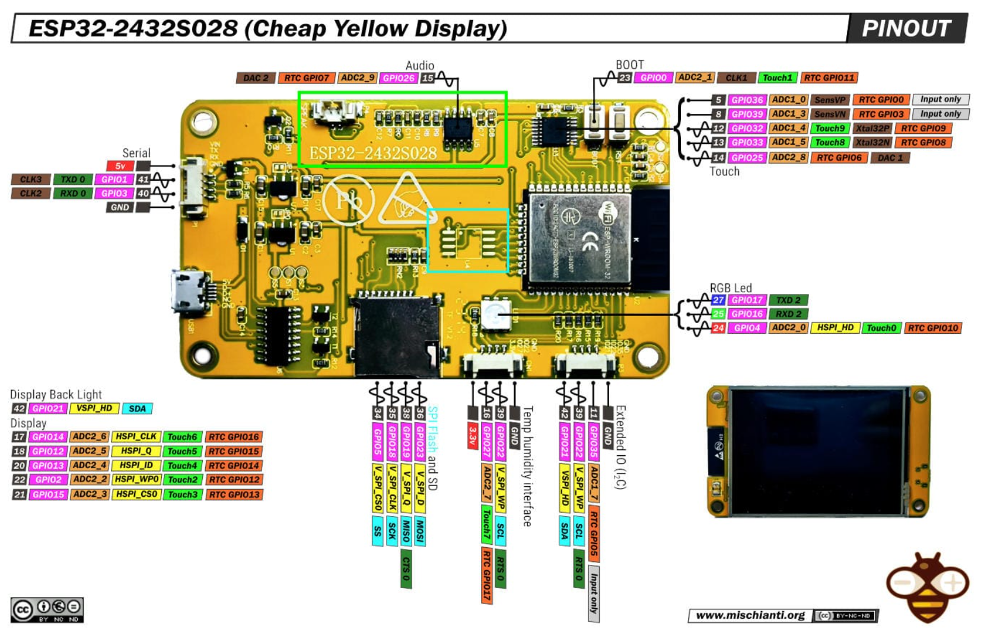
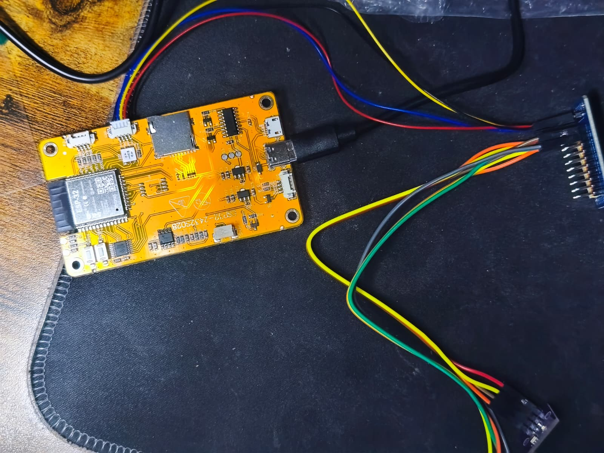
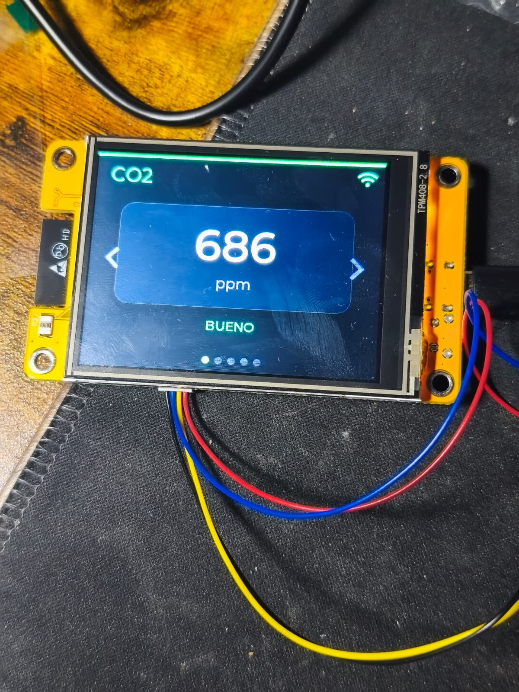
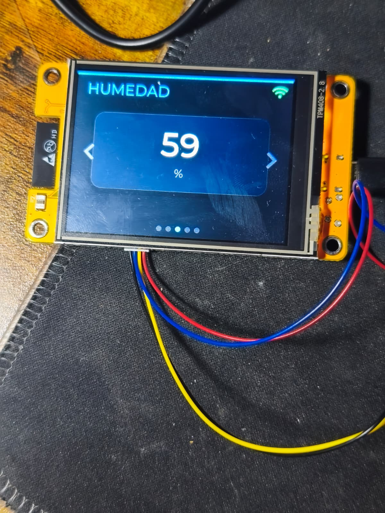
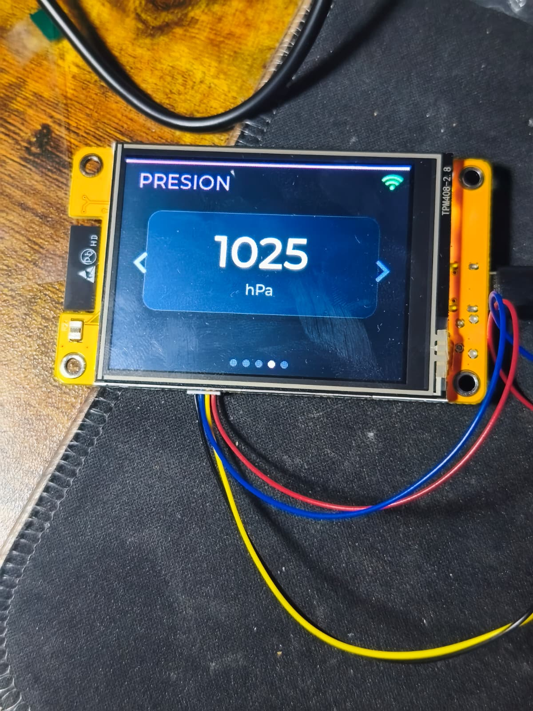
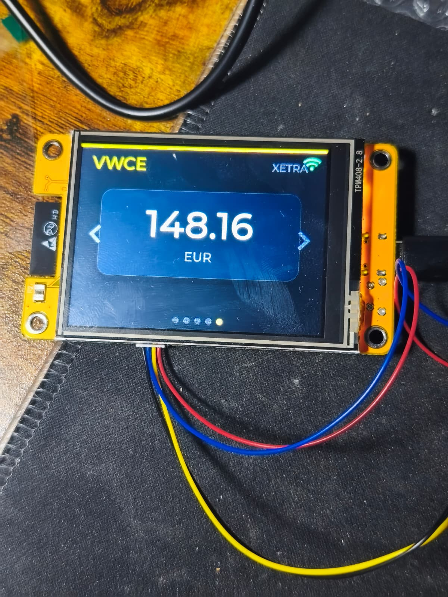
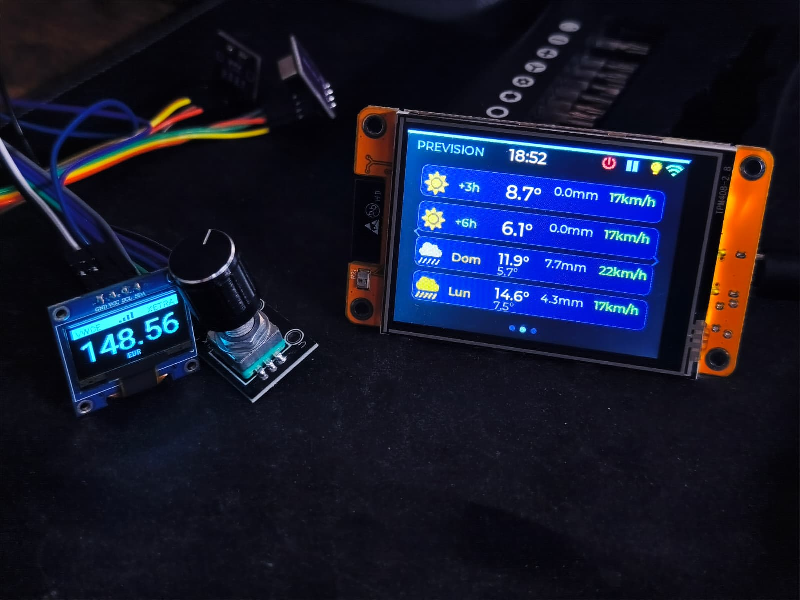
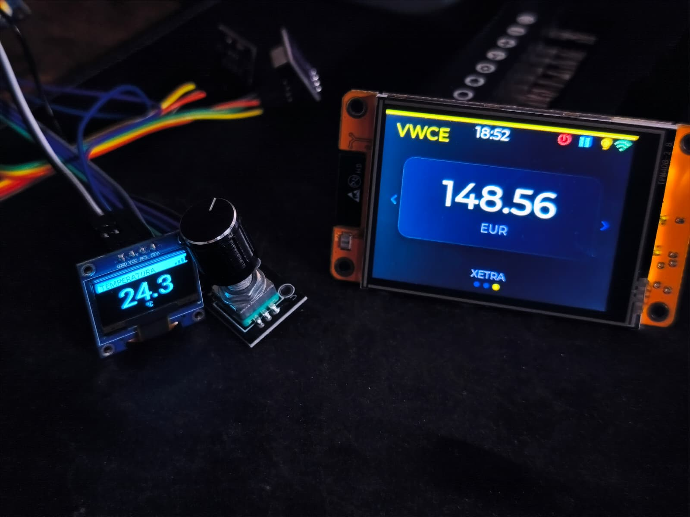

# CYD — Cheap Yellow Display (ESP32-2432S028R)

<p align="center">
  
</p>

<p align="center">
  
</p>

Guía para los proyectos basados en el **ESP32-2432S028R** (CYD) — una placa todo-en-uno con pantalla **TFT 2.8" a color** (ST7789, 320×240 px), táctil resistivo (XPT2046) e interfaz gráfica **LVGL**.

> **Con la CYD no necesitas el ESP32-C3 Super Mini ni la pantalla OLED** — la CYD ya incluye su propio ESP32 y display integrado. Solo necesitas los sensores I²C y opcionalmente el hub.

---

## Lista de piezas

- [Pantalla Inteligente ESP32 2.8" — TFT 240×320 táctil (ESP32-2432S028R)](https://es.aliexpress.com/item/1005010399042230.html)
- [Sensor SCD40/SCD41 — CO₂, temperatura y humedad I2C](https://es.aliexpress.com/item/1005009897956849.html)
- [AHT20 + BMP280 — temperatura, humedad y presión](https://es.aliexpress.com/item/1005005321276932.html)
- [Módulo hub I2C (expansión de bus)](https://es.aliexpress.com/item/1005002811407142.html) *(opcional pero recomendado)*

---

## Hardware integrado del CYD

La CYD es una placa completa con ESP32-WROOM-32 y estos periféricos:

| Componente | Pines | Descripción |
|---|---|---|
| Display ST7789 | HSPI: CLK=14, MOSI=13, MISO=12, CS=15, DC=2 | Pantalla TFT 320×240 a color |
| Táctil XPT2046 | VSPI: CLK=25, MOSI=32, MISO=39, CS=33, IRQ=36 | Táctil resistivo |
| Backlight | GPIO21 (LEDC PWM) | Brillo regulable por software |
| LED RGB | R=GPIO4, G=GPIO16, B=GPIO17 (activo-bajo) | Indicador de estado |
| Conector CN1 | GND, GPIO22, GPIO27, 3V3 | **Bus I²C para sensores externos** |

> [Pinout completo del CYD — RandomNerdTutorials](https://randomnerdtutorials.com/esp32-cheap-yellow-display-cyd-pinout-esp32-2432s028r/)

---

## Conexión de sensores (conector CN1)

Los sensores se conectan al conector **CN1** del CYD por **I²C** — el mismo protocolo que en el ESP32-C3, solo cambian los pines:

| | ESP32-C3 | CYD (CN1) |
|---|---|---|
| SDA | GPIO4 | **GPIO22** |
| SCL | GPIO5 | **GPIO27** |
| VCC | 3V3 | 3V3 |
| GND | GND | GND |

Los tres sensores van en paralelo al mismo bus (direcciones distintas: SCD40=`0x62`, AHT20=`0x38`, BMP280=`0x77`).

### Con hub I²C (recomendado)

El hub I²C centraliza las conexiones y queda más limpio:

```
CYD CN1                    Hub I²C
  3.3V ────────────────── VCC
  GPIO22 (SDA) ───────── SDA
  GPIO27 (SCL) ───────── SCL
  GND ─────────────────── GND

Hub I²C puertos:
  Puerto 1 ──── SCD40 (CO₂)
  Puerto 2 ──── AHT20+BMP280 (T, H, P)
```

### Sin hub (daisy-chain)

También se pueden cablear en paralelo directamente:

| Pin sensor | Pin CYD (CN1) |
|---|---|
| **VCC** | **3V3** |
| **GND** | **GND** |
| **SDA** | **GPIO22** |
| **SCL** | **GPIO27** |

> ⚠ GPIO21 está ocupado por el backlight. GPIO35 es input-only. Solo GPIO22 y GPIO27 están disponibles para I²C en el CYD.

---

## Interfaz LVGL — Proyectos 8–10 (datos ambientales)

Los proyectos 8, 9 y 10 (`cyd_dummy`, `cyd_sensors_vwce_dummy`, `cyd_sensors_vwce`) usan una interfaz de **5 páginas** con barra de acento de color único:

- **Tema oscuro** (fondo `#0D1117`) con tarjetas centrales sombreadas
- **5 páginas:**
  - 🟢 Verde — CO₂
  - 🟠 Naranja — Temperatura
  - 🔵 Azul — Humedad
  - 🟣 Púrpura — Presión
  - 🟡 Dorado — VWCE
- **Valor grande** centrado en Montserrat 48 px — legible a distancia
- **Indicador de calidad del aire** en la página CO₂ (verde/amarillo/naranja/rojo)
- **Navegación táctil:**
  - Deslizar (swipe) izquierda/derecha → página siguiente/anterior con animación
  - Botones ‹ y › en los laterales (zona amplia de toque)
  - 5 puntos indicadores de página activa
  - Navegación circular (`page_wrap: true`)
- **Icono WiFi** — verde = conectado, rojo = desconectado
- **Auto-dim** del backlight tras 60 s sin tocar — se restaura al tocar

<p align="center">
  
  
</p>
<p align="center">
  
  
</p>

---

## Interfaz LVGL — Proyectos 11–12 (estación meteorológica)

Los proyectos 11 y 12 (`cyd_weather_dummy`, `cyd_weather`) tienen una interfaz diferente, diseñada para mostrar datos meteorológicos exteriores junto con los sensores interiores.

<p align="center">
  
  
</p>
<p align="center">
  
</p>

### Estructura de páginas

**3 páginas** con 3 puntos indicadores en la parte inferior:

| Página | Contenido |
|---|---|
| 1 — Panel | Icono meteo + temperatura exterior + viento + PM2.5/PM10 + CO₂ + T.INT + HUM + Presión |
| 2 — Previsión | 4 filas: +3h, +6h, día siguiente (D+1), pasado mañana (D+2) |
| 3 — VWCE | Precio del fondo VWCE (XETRA) en grande |

### Barra superior

La barra superior ocupa los 24 px superiores de la pantalla y tiene dos zonas:

- **Izquierda**: localización (p.ej. "Luanco") + hora (HH:MM) en el centro
- **Derecha** (4 iconos): ⏻ · ⏸ · 💡 · 📶

| Icono | Función |
|---|---|
| ⏻ (power) | Desactiva/activa el ahorro de energía. Rojo = energía siempre encendida; gris azulado = modo normal |
| ⏸/▶ (play/pausa) | Activa/pausa la auto-rotación de páginas. **Arranca en ON por defecto.** |
| 💡 (bombilla) | Cicla el brillo: 100% → 50% → 25% → 100% |
| 📶 (wifi) | Estado de conexión: verde = conectado, rojo = desconectado |

### Página 1 — Panel

- **Zona izquierda**: icono meteorológico grande (FontAwesome) + temperatura exterior (Montserrat 40 px) + símbolo °C
- **Zona derecha**: VIENTO en km/h y PM2.5 / PM10 en µg/m³, apilados verticalmente
- **Grid de sensores interiores** (4 celdas):
  - CO₂ (ppm) con color dinámico: verde < 700 / amarillo 700–1000 / naranja 1000–1500 / rojo > 1500; "ppm" se posiciona justo al lado del número
  - T.INT (°C)
  - HUM (%)
  - Presión (hPa) — número grande, "hPa" en fuente pequeña
- **Reset CO₂** (solo `cyd_weather.yaml`): mantener pulsado el área CO₂ ~1 s → diálogo de confirmación → **Sí** ejecuta `scd4x.factory_reset`

### Página 2 — Previsión

4 filas verticalmente centradas entre el encabezado y los puntos de página:

| Columna | Contenido |
|---|---|
| Etiqueta | +3h / +6h / día de la semana (D+1) / día de la semana (D+2) |
| Icono | Condición meteorológica (FontAwesome) |
| Temperatura | Valor en °C |
| Precipitación | Milímetros previstos (mm) |
| Viento | km/h |

### Página 3 — VWCE

- Precio del fondo VWCE en Montserrat 48 px
- Badge "XETRA" centrado en la parte inferior

### Comportamiento del backlight

- **Auto-dim**: tras 60 s sin interacción táctil, el brillo baja al 10%
- **Restaurar**: cualquier toque reactiva el brillo completo
- **Desactivar**: pulsar ⏻ mantiene el brillo al 100% permanentemente (icono en rojo)
- **Ajuste manual**: pulsar 💡 cicla entre tres niveles de brillo

---

## Calibración del táctil

Los valores por defecto (`x_min: 280`, `x_max: 3860`, `y_min: 340`, `y_max: 3860`) funcionan para la mayoría de unidades CYD. Si el toque no coincide con la posición:

1. Activa el log a `DEBUG`
2. Toca las cuatro esquinas y anota los valores raw
3. Actualiza `calibration` en el YAML

Si la pantalla aparece invertida, cambia `mirror_x` / `mirror_y` en las secciones `transform` del display y del touchscreen.

---

## Configuración de Home Assistant

Los Proyectos 11 y 12 (`cyd_weather_dummy` y `cyd_weather`) requieren archivos adicionales en Home Assistant. Todos están en la carpeta `homeassistant/` del repositorio — cópialos al directorio de configuración de HA.

### Archivos necesarios

| Archivo | Proyectos que lo usan | Qué hace |
|---|---|---|
| `vwce_sensor.yaml` | P8, P9, P11, P12 | Sensor REST — precio VWCE desde Yahoo Finance |
| `air_quality_sensor.yaml` | P11, P12 | Sensor REST — PM2.5 y PM10 desde Open-Meteo (1 req/hora) |
| `weather_sensors.yaml` | P11, P12 | Templates — condición actual + previsión +3h, +6h, día+1, día+2 |

### Incluir en `configuration.yaml`

```yaml
sensor:   !include vwce_sensor.yaml
rest:     !include air_quality_sensor.yaml
template: !include weather_sensors.yaml
```

El `configuration.yaml` del repositorio ya tiene las tres líneas como referencia.

### `secrets.yaml` de Home Assistant

`air_quality_sensor.yaml` lee la URL de la API desde `secrets.yaml` de HA (no del ESPHome). Copia `homeassistant/secrets.yaml.example` a `secrets.yaml` en tu config de HA y sustituye `LAT` y `LON` por tus coordenadas:

```yaml
air_quality_url: "https://air-quality-api.open-meteo.com/v1/air-quality?latitude=43.3603&longitude=-5.8448&current=pm2_5,pm10"
```

> La API de Open-Meteo es gratuita y no requiere clave. Las coordenadas las puedes obtener en [latlong.net](https://www.latlong.net/) o en Google Maps (clic derecho sobre tu ubicación).

### Entidad weather

`weather_sensors.yaml` usa `weather.casa` como entidad base. Si en tu instalación la entidad tiene otro nombre (p.ej. `weather.home` o `weather.mi_ciudad`), actualiza todas las referencias en el archivo.

### `esphome/secrets.yaml` para proyectos Weather (P11 y P12)

Además de WiFi/OTA/API, `cyd_weather_dummy.yaml` y `cyd_weather.yaml` usan dos claves extra en `esphome/secrets.yaml`:

```yaml
location_name: "home"       # prefijo de entidades HA: sensor.home_temperatura, etc.
location_display: "Mi Casa" # texto visible en la barra superior
```

> En ambos YAML la hora está fijada a `timezone: "Europe/Madrid"`. Si estás en otra zona horaria, cámbiala en el propio YAML antes de flashear.

### Diferencias respecto al ESP32-C3

| | ESP32-C3 (Proyectos 1–7) | CYD (Proyectos 8–12) |
|---|---|---|
| Placa | ESP32-C3 Super Mini | ESP32-2432S028R (ESP32-WROOM-32) |
| `esp32.board` | `esp32-c3-devkitm-1` | `esp32dev` |
| Framework | `esp-idf` | `esp-idf` |
| Display | SSD1306 128×64 mono I²C | ST7789 320×240 color SPI (HSPI) |
| Táctil | — | XPT2046 resistivo SPI (VSPI) |
| Gráficos | Lambdas C++ (canvas) | **LVGL** (widgets nativos) |
| I²C sensores | GPIO4 (SDA) / GPIO5 (SCL) | GPIO22 (SDA) / GPIO27 (SCL) — CN1 |
| Navegación | Rotación automática o encoder | Swipe + botones táctiles |
| Backlight | — | PWM en GPIO21 con auto-dim |
| LED RGB integrado | — | GPIO4/R, GPIO16/G, GPIO17/B |

---

## Proyectos

### Proyecto 8: CYD con datos desde Home Assistant (`cyd_dummy.yaml`)

Los sensores físicos están conectados al **ESP32-C3** y éste publica los datos a Home Assistant. La CYD los recibe desde HA y los muestra en pantalla. **Requiere que el ESP32-C3 esté activo y conectado a HA.**

| Dato | Origen |
|---|---|
| CO₂, Temperatura, Humedad, Presión | Desde HA (publicados por ESP32-C3) |
| VWCE | Desde HA (sensor REST) |

```sh
esphome run esphome/cyd_dummy.yaml --device COMx
esphome run esphome/cyd_dummy.yaml --device sensors-cyd-dummy.local
```

---

### Proyecto 9: CYD con sensores I²C directos + VWCE desde HA (`cyd_sensors_vwce_dummy.yaml`)

Los sensores van conectados **físicamente al CYD** por el conector CN1. No necesita el ESP32-C3 para los datos ambientales. VWCE sigue viniendo de HA.

| Dato | Origen |
|---|---|
| CO₂, Temperatura, Humedad, Presión | **Sensores I²C en CN1** (directos) |
| VWCE | Desde HA (sensor REST) |

```sh
esphome run esphome/cyd_sensors_vwce_dummy.yaml --device COMx
esphome run esphome/cyd_sensors_vwce_dummy.yaml --device sensors-cyd-vwce-dummy.local
```

---

### Proyecto 10: CYD con sensores I²C directos + VWCE desde Yahoo Finance (`cyd_sensors_vwce.yaml`)

Igual que el Proyecto 9 pero **el ESP32 consulta Yahoo Finance directamente** — no necesita HA para el precio de VWCE.

| Dato | Origen |
|---|---|
| CO₂, Temperatura, Humedad, Presión | **Sensores I²C en CN1** (directos) |
| VWCE | HTTP directo a Yahoo Finance (cada 60 s) |

```sh
esphome run esphome/cyd_sensors_vwce.yaml --device COMx
esphome run esphome/cyd_sensors_vwce.yaml --device sensors-cyd-vwce.local
```

---

### Proyecto 11: CYD estación meteorológica sin sensores I²C (`cyd_weather_dummy.yaml`)

Pantalla meteorológica con **3 páginas** (Panel, Previsión, VWCE). La información meteorológica viene de Home Assistant a través del template `weather_sensors.yaml`. Los sensores interiores (CO₂, temperatura, humedad, presión) se leen desde HA — publicados por otro ESP32 (ej. ESP32-C3). No necesita sensores físicos conectados al CYD.

| Dato | Origen |
|---|---|
| Temperatura ext., viento, condición | `weather_sensors.yaml` en HA (`weather.casa`) |
| Previsión +3h, +6h, día+1, día+2 | `weather_sensors.yaml` en HA (`weather.get_forecasts`) |
| CO₂, T interior, H interior, Presión | Desde HA (publicados por ESP32-C3) |
| PM2.5 / PM10 | `air_quality_sensor.yaml` en HA (Open-Meteo) |
| VWCE | Desde HA (`sensor.vwce_precio_yahoo`) |

**Requiere** incluir `weather_sensors.yaml` y `air_quality_sensor.yaml` en Home Assistant. También requiere que el ESP32-C3 con sensores esté activo y publicando a HA.

```sh
esphome run esphome/cyd_weather_dummy.yaml --device COMx
esphome run esphome/cyd_weather_dummy.yaml --device cyd-weather-dummy.local
```

---

### Proyecto 12: CYD estación meteorológica con sensores I²C (`cyd_weather.yaml`)

Igual que el Proyecto 11 pero con **sensores I²C físicos conectados al CN1** para los datos interiores (CO₂, temperatura, humedad, presión). Los datos meteorológicos exteriores siguen viniendo de HA. Permite tener dos estaciones independientes en habitaciones distintas sin que ninguna dependa de la otra.

| Dato | Origen |
|---|---|
| Temperatura ext., viento, condición | `weather_sensors.yaml` en HA (`weather.casa`) |
| Previsión +3h, +6h, día+1, día+2 | `weather_sensors.yaml` en HA (`weather.get_forecasts`) |
| CO₂, T interior, H interior, Presión | **Sensores I²C en CN1** (directos) |
| PM2.5 / PM10 | `air_quality_sensor.yaml` en HA (Open-Meteo) |
| VWCE | Desde HA (`sensor.vwce_precio_yahoo`) |

#### Reset de calibración CO₂

Mantener pulsado el área del valor CO₂ en pantalla (~1 s) muestra un diálogo de confirmación: **"¿Resetear CO₂?"**. Pulsando **Sí** se ejecuta `scd4x.factory_reset` — borra la calibración acumulada y reinicia el ASC desde cero. Útil al cambiar el sensor de habitación o si las lecturas se han desviado. Pulsando **No** el diálogo se cierra sin cambios.

**Requiere** tanto `weather_sensors.yaml` como `air_quality_sensor.yaml` configurados en Home Assistant.

```sh
esphome run esphome/cyd_weather.yaml --device COMx
esphome run esphome/cyd_weather.yaml --device cyd-weather.local
```

---

### Proyecto 13: CYD estación meteorológica con compensación térmica para caja 3D (`cyd_weather_offset_3dbox.yaml`)

Variante del Proyecto 12 pensada para montar el CYD dentro de una **caja 3D impresa cerrada**. La caja es estéticamente superior pero introduce un problema físico: el display ST7789 y el propio ESP32 generan calor que queda atrapado, calentando los sensores I²C y falseando sus lecturas de temperatura y humedad.

Este proyecto añade un **modelo térmico dinámico** que compensa ese error en tiempo real según el estado del backlight.

> 🖨️ **Modelo 3D de la carcasa:** [Thingiverse — thing 7340015](https://www.thingiverse.com/thing:7340015) (adaptación propia de un diseño existente, listo para imprimir).

#### El problema: la caja 3D es un pequeño horno

Cuando encerras el CYD en una caja sin ventilación forzada:

- El **display TFT** consume ~1-2 W (según brillo) y casi todo se convierte en calor
- El **ESP32** disipa ~0.3-0.5 W en uso normal (WiFi + CPU)
- La **caja impresa** tiene muy poca conductividad térmica (PLA/PETG son aislantes)

Resultado: los sensores I²C (AHT20, BMP280, SCD40) miden el **aire dentro de la caja**, no el de la habitación. En la práctica, en equilibrio térmico con pantalla al 100%:

| Magnitud | Error típico |
|---|---|
| Temperatura | **+3 °C** (caja más caliente) |
| Humedad relativa | **−9 %** (aire caliente → HR menor para la misma humedad absoluta) |
| Presión | **−4 hPa** (efecto más sutil, probablemente convección interior) |

Estos errores son físicos, no de los sensores, y **no desaparecen con mejor calibración de fábrica**. Hay que compensarlos por software.

#### La solución: offsets dinámicos que siguen al backlight

El fallo obvio sería aplicar un offset fijo (-2.9 °C, +9.2 % HR, etc.). Pero el calor interno no es constante:

- Con pantalla atenuada (auto-dim) o apagada → la caja se enfría hacia ambiente
- Con pantalla al 100% → la caja alcanza su equilibrio caliente
- Con brillo intermedio → calor proporcional

Aplicar un offset fijo calibrado para "pantalla encendida" descompensa el sensor cuando la pantalla se atenúa (y viceversa).

La compensación correcta es un **modelo térmico de primer orden**: una variable interna `thermal_load` (0.0 = caja fría, 1.0 = caja caliente) que sigue al brillo del backlight con la misma constante de tiempo térmica que la caja física (τ ≈ 5 minutos).

```
target  = brillo_actual_del_backlight   (0.0 a 1.0)
thermal_load ← thermal_load + α · (target − thermal_load)
```

donde `α = Δt / (τ + Δt)` con Δt = 30s (periodo de actualización) y τ = 300s (constante de tiempo térmica empírica de la caja). Esto es un filtro **IIR de primer orden**, matemáticamente equivalente a un circuito RC: simula cómo se calienta y enfría la caja con retardo físico real.

Luego los offsets finales se **interpolan linealmente** entre los valores "fríos" y "calientes":

```yaml
# Temperatura: -2.9°C (frío) → -3.1°C (caliente)
- lambda: 'return x + (-2.9f - 0.2f * id(thermal_load));'

# Humedad: +9.2% (frío) → +10.0% (caliente)
- lambda: 'return x + (9.2f + 0.8f * id(thermal_load));'
```

#### Qué offsets lleva cada magnitud

| Magnitud | Tipo | Valor frío | Valor caliente | Razón |
|---|---|---|---|---|
| **Temperatura** | Dinámico | −2.9 °C | −3.1 °C | Afectada directamente por calor de caja |
| **Humedad** | Dinámico | +9.2 % | +10.0 % | La HR depende de la T (misma humedad absoluta, más T → menos HR) |
| **Presión** | Estático | +4.0 hPa | +4.0 hPa | El BMP280 apenas se afecta por cambios pequeños de T |
| **CO₂** | Sin offset | — | — | SCD40 tiene autocalibración ASC de 7 días; forzar un offset enmascararía problemas reales |

#### Comportamiento en el tiempo

Al encender el CYD o tras una OTA:
1. `thermal_load` arranca en 0.5 (estado neutro, ya que la variable no se persiste)
2. Cada 30 s se actualiza hacia el brillo actual
3. En unos **10–15 minutos** converge al estado térmico real (3 veces τ)
4. Los offsets se aplican en tiempo real a cada lectura de sensor

Durante la transición los valores leídos son ligeramente imprecisos (±0.1 °C en el peor caso), pero se alinean con la realidad en cuanto la caja alcanza equilibrio térmico — que es también el tiempo físico que tardaría cualquier sensor real en estabilizarse.

#### Por qué no se persiste `thermal_load` en NVS

Sería técnicamente posible añadir `restore_value: true` para recordar el estado térmico tras un reboot. Pero:

- Cada cambio se escribiría en la flash NVS del ESP32
- Para un error residual de 0.1 °C durante 15 min tras cada boot, no compensa el desgaste acumulado de la flash (aunque sería pequeño)
- Los reboots en uso normal son muy infrecuentes

Si en tu caso aplicases OTAs frecuentemente (p.ej. durante desarrollo), se podría activar sin problemas.

#### Cómo calibrar para TU caja

Los valores por defecto (−2.9/−3.1 °C, +9.2/+10.0 % HR, +4.0 hPa) están calibrados para una caja de PLA con paredes de 2 mm y pocas rejillas. Si tu diseño es distinto necesitarás recalibrar. **Necesitas un sensor de referencia** (por ejemplo un C3 con el mismo AHT20+BMP280 sin caja, al lado del CYD).

**Metodología de calibración en dos puntos:**

1. **Punto frío** (pantalla atenuada/apagada varias horas, en equilibrio):
   - Medir `(T_cyd, H_cyd, P_cyd)` vs `(T_ref, H_ref, P_ref)` del sensor de referencia
   - Offset temperatura frío = T_ref − T_cyd_raw = T_ref − (T_cyd − offset_actual)
   - Análogo para humedad y presión
2. **Punto caliente** (pantalla al 100% en equilibrio, mínimo 30 min):
   - Medir ambos sensores
   - Calcular offsets calientes del mismo modo
3. **Actualizar los coeficientes** de las lambdas:
   ```yaml
   # Temperatura: valor_frio + (valor_caliente − valor_frio) * thermal_load
   - lambda: 'return x + (T_FRIO + (T_CAL - T_FRIO) * id(thermal_load));'
   ```

**Metodología simplificada en un punto** (si no tienes sensor de referencia pero conoces la temperatura ambiente):

- Usa un termómetro/higrómetro casero junto al CYD
- Mide con pantalla encendida horas (punto caliente)
- Ajusta el offset "caliente" directamente
- Asume el "frío" = caliente + 0.2 °C (diferencia típica por ST7789 encendido)

#### Verificación

En los logs de ESPHome (`esphome logs cyd_weather_offset_3dbox.yaml`) puedes comprobar el comportamiento:

```
[D][sensor:124]: 'Temperatura Interior' >> 22.73 °C    ← valor final con offset aplicado
[D][sensor:124]: 'BMP280 Temperatura' >> 24.5 °C       ← raw del BMP280 (sin offset)
```

La diferencia entre ambos confirma que la caja sí está más caliente que el ambiente y que el offset está actuando.

Para inspeccionar `thermal_load` puedes añadir temporalmente un sensor template:

```yaml
sensor:
  - platform: template
    name: "Thermal Load"
    lambda: 'return id(thermal_load);'
    update_interval: 60s
```

Verás en HA cómo sube/baja según juegues con el brillo del backlight.

```sh
esphome run esphome/cyd_weather_offset_3dbox.yaml --device COMx
esphome run esphome/cyd_weather_offset_3dbox.yaml --device cyd-weather-box.local
```

---

### Diferencias entre Proyectos 8–13

| | P8 (`cyd_dummy`) | P9 (`cyd_sensors_vwce_dummy`) | P10 (`cyd_sensors_vwce`) | P11 (`cyd_weather_dummy`) | P12 (`cyd_weather`) | P13 (`cyd_weather_offset_3dbox`) |
|---|---|---|---|---|---|---|
| Sensores ambientales | Desde Home Assistant | Físicos I²C en CN1 | Físicos I²C en CN1 | Desde HA (`weather.casa`) | Desde HA (`weather.casa`) | Desde HA (`weather.casa`) |
| Bus I²C | No configurado | GPIO22 / GPIO27 | GPIO22 / GPIO27 | No configurado | GPIO22 / GPIO27 | GPIO22 / GPIO27 |
| VWCE | Desde HA | Desde HA | HTTP directo Yahoo Finance | Desde HA | Desde HA | Desde HA |
| PM2.5 / PM10 | No | No | No | Desde HA | Desde HA | Desde HA |
| Previsión meteorológica | No | No | No | Desde HA | Desde HA | Desde HA |
| Sensores interiores | Desde HA (ESP32-C3) | Físicos I²C en CN1 | Físicos I²C en CN1 | Desde HA (ESP32-C3) | Físicos I²C en CN1 | Físicos I²C en CN1 |
| Compensación térmica caja 3D | — | — | — | — | — | **Dinámica (τ≈5min)** |
| Necesita ESP32-C3 activo | Sí | No | No | Sí (sensores int.) | No | No |
| Necesita Home Assistant | Sí | Solo para VWCE | No | Sí | Sí | Sí |
| Páginas | 5 (CO₂,T,H,P,VWCE) | 5 (CO₂,T,H,P,VWCE) | 5 (CO₂,T,H,P,VWCE) | 3 (Panel, Previsión, VWCE) | 3 (Panel, Previsión, VWCE) | 3 (Panel, Previsión, VWCE) |

> **Agradecimiento:** Este proyecto se inspira en parte en el excelente trabajo de [ESP32-HAM-CLOCK de SP3KON](https://github.com/SP3KON/ESP32-HAM-CLOCK), que sirvió de referencia para el diseño de la CYD estación meteorológica.
